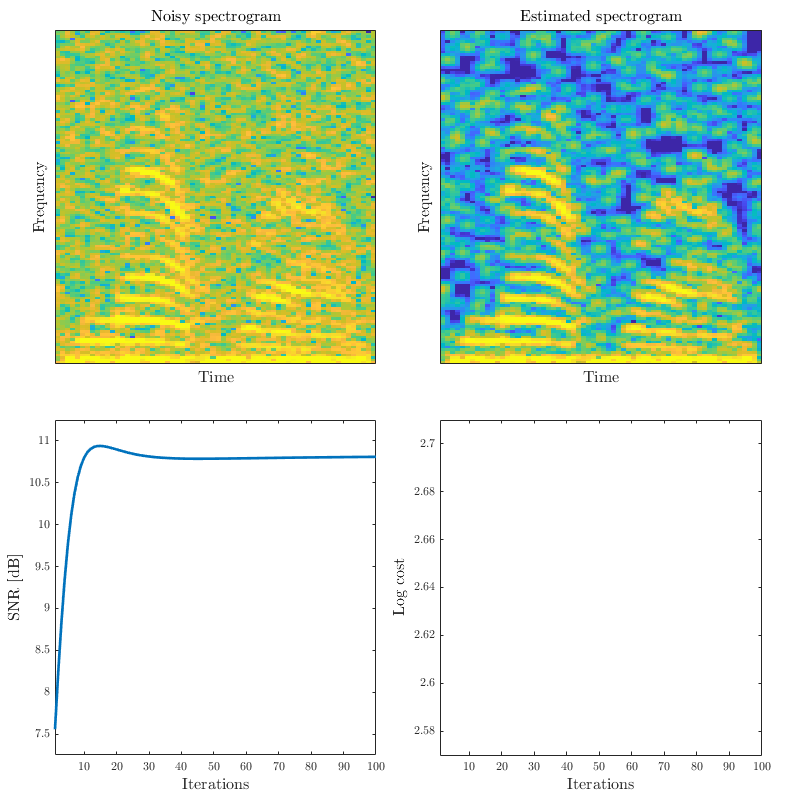

# Speech denoising by regualizing a mixed norm


IFToolbox can be downloaded from teh codeocean [https://codeocean.com/capsule/1906064/tree/v1](https://codeocean.com/capsule/1906064/tree/v1)


```matlab:Code
set(0, 'defaultTextInterpreter', 'latex');
set(0, 'defaultAxesTickLabelInterpreter', 'latex');
set(0, 'defaultLegendInterpreter', 'latex');
set(0, 'defaultColorbarTickLabelInterpreter', 'latex');
```


```matlab:Code
% Fix seed
rng(777);
addpath(genpath('../../../../IFToolbox'))

% Parametr
std_n = 0.3;
winlen = 256;
shift = winlen/4;
```


```matlab:Code
% Set STFT and iSTFT
[win, ~] = generalizedCosWin(winlen, 'hann');
win = calcCanonicalTightWindow(win, shift);
win = win/norm(win)*sqrt(shift/winlen);  % operator norm -> 1
STFT = @(X) DGT(X, win, shift);
iSTFT = @(X) invDGT(X, win, shift, winlen)*winlen;
```


```matlab:Code
% Load signal
eval('load mtlb, s = mtlb; clear mtlb')
s = zeroPaddingForDGT(s, shift, winlen);

% Make noise
n = std_n*randn(length(s), 1);

% Calculate observed signal
v = s+n;
```


```matlab:Code
% Check property of STFT
cv = STFT(v);
v_ = iSTFT(cv);
disp(['Reconstruction error: ', num2str(max(abs(v-v_)/max(v)))])
```


```text:Output
Reconstruction error: 2.8144e-16
```


```matlab:Code
% Initialize variable
uinit = cv;
u = uinit;
lm = 0.3;
stepsize = 0.1;
maxiter = 100;
snrs = nan(maxiter,1);
costs = nan(maxiter,1);

% Set cost function
cost = @(u) 1/2*norm(iSTFT(u)-v)^2+lm*sum(sum(abs(u)));
```


```matlab:Code
% Set video
video = VideoWriter('../../data/speech_denoisng','MPEG-4');
video.Quality = 100;
open(video);

% Initialize visualization
fig(1) = figure(1);
fig_pos = [0, 800, 800, 800];
set(fig(1),'Position',fig_pos);

t = tiledlayout(2, 2,'TileSpacing','compact','padding','compact');
nexttile(1)
oriplot = imagesc(20*log10(abs(flipud(cv))));
caxis([-60, 0]);
xticks([])
yticks([])
xlabel('Time', 'FontSize', 12)
ylabel('Frequency', 'FontSize', 12)
title('Noisy spectrogram', 'FontSize', 12)

nexttile(2)
specplot = imagesc(20*log10(abs(flipud(STFT(iSTFT(u))))));
caxis([-60, 0]);
xticks([])
yticks([])
xlabel('Time', 'FontSize', 12)
ylabel('Frequency', 'FontSize', 12)
title('Estimated spectrogram', 'FontSize', 12)

nexttile(3)
snrplot = plot(snrs, 'LineWidth',2);
xlim([1, maxiter])
ylim([7.25, 11.25])
xlabel('Iterations', 'FontSize', 12)
ylabel('SNR [dB]', 'FontSize', 12)

nexttile(4)
cplot = plot(costs, 'LineWidth',2);
xlim([1, maxiter])
ylim([2.57, 2.71])
xlabel('Iterations', 'FontSize', 12)
ylabel('Log cost', 'FontSize', 12)

% Main loop of ISTA
for m = 1:maxiter
    
    % Update u
    u = proxl12(u-stepsize*(STFT(iSTFT(u))-STFT(v)), lm*stepsize);
    
    % Visualization
    snrs(m) = snr(s, s-iSTFT(u));
    costs(m) = log10(cost(u));
    specplot.CData = 20*log10(abs(flipud(STFT(iSTFT(u)))));
    snrplot.YData = snrs;
    cplot.YData = costs;
    drawnow
    
    % Write video
    video_frame = getframe(fig(1));
    writeVideo(video,video_frame);
    
    pause(0.1)
    
end
```


```matlab:Code
close(video);
```


```matlab:Code
disp(['SNR of observed signal: ', num2str(snr(s, n))])
```


```text:Output
SNR of observed signal: 6.8033
```


```matlab:Code
disp(['SNR of result: ', num2str(snr(s, s-iSTFT(u)))])
```


```text:Output
SNR of result: 10.8895
```

# Social sparsity


[https://hal.archives-ouvertes.fr/hal-00691774v1/document](https://hal.archives-ouvertes.fr/hal-00691774v1/document)


```matlab:Code
% Initialize variable
uinit = cv;
u = uinit;
lm = 0.18;
weight = gausswin(3).*gausswin(3)';
weight = weight/sum(abs(weight));
stepsize = 0.1;
maxiter = 100;
snrs = nan(maxiter,1);
costs = nan(maxiter,1);
```


```matlab:Code
% Set video
video = VideoWriter('../../data/speech_denoisng_social','MPEG-4');
video.Quality = 100;
open(video);

% Initialize visualization
fig(1) = figure(1);
fig_pos = [0, 800, 800, 800];
set(fig(1),'Position',fig_pos);

t = tiledlayout(2, 2,'TileSpacing','compact','padding','compact');
nexttile(1)
oriplot = imagesc(20*log10(abs(flipud(cv))));
caxis([-60, 0]);
xticks([])
yticks([])
xlabel('Time', 'FontSize', 12)
ylabel('Frequency', 'FontSize', 12)
title('Noisy spectrogram', 'FontSize', 12)

nexttile(2)
specplot = imagesc(20*log10(abs(flipud(STFT(iSTFT(u))))));
caxis([-60, 0]);
xticks([])
yticks([])
xlabel('Time', 'FontSize', 12)
ylabel('Frequency', 'FontSize', 12)
title('Estimated spectrogram', 'FontSize', 12)

nexttile(3)
snrplot = plot(snrs, 'LineWidth',2);
xlim([1, maxiter])
ylim([7.25, 11.25])
xlabel('Iterations', 'FontSize', 12)
ylabel('SNR [dB]', 'FontSize', 12)

nexttile(4)
cplot = plot(costs, 'LineWidth',2);
xlim([1, maxiter])
ylim([2.57, 2.71])
xlabel('Iterations', 'FontSize', 12)
ylabel('Log cost', 'FontSize', 12)

% Main loop of ISTA
for m = 1:maxiter
    
    % Update u
    u = proxSL(u-stepsize*(STFT(iSTFT(u))-STFT(v)), lm*stepsize, weight);
    
    % Visualization
    snrs(m) = snr(s, s-iSTFT(u));
    specplot.CData = 20*log10(abs(flipud(STFT(iSTFT(u)))));
    snrplot.YData = snrs;
    cplot.YData = costs;
    drawnow
    
    % Write video
    video_frame = getframe(fig(1));
    writeVideo(video,video_frame);
    
    pause(0.1)
    
end
```





```matlab:Code
close(video);
```


```matlab:Code
disp(['SNR of observed signal: ', num2str(snr(s, n))])
```


```text:Output
SNR of observed signal: 6.8033
```


```matlab:Code
disp(['SNR of result: ', num2str(snr(s, s-iSTFT(u)))])
```


```text:Output
SNR of result: 10.8101
```


```matlab:Code
function y = proxl12(x, gam)
    [f,t] = size(x);
    x = reshape(x', [4, f*t/4]);
    l2 = sqrt(sum(abs(x).^2, 1));
    ratio = max(1-(gam./l2), 0);
    y = ratio.*x;
    y = reshape(y, [t, f])';
end

function x = proxSL(x,gam,w)
    absx = sqrt(conv2(abs(x).^2,w,'same'));
    ratio = max(1-gam./absx, 0);
    x = ratio.*x;
end
```

