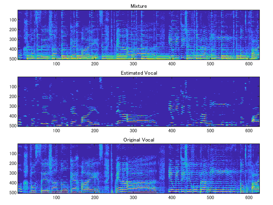

# Vocal extraction via low-rank/sparse decomposition


IFToolbox can be downloaded from teh codeocean [https://codeocean.com/capsule/1906064/tree/v1](https://codeocean.com/capsule/1906064/tree/v1)


```matlab:Code
% Fix seed
rng(0);
addpath(genpath('../../../../IFToolbox'))
```


```matlab:Code
% Parametr
fs = 16000;
winlen = 1024;
shift = winlen/4;
```


```matlab:Code
% Set STFT and iSTFT
[win, ~] = generalizedCosWin(winlen, 'hann');
win = calcCanonicalTightWindow(win, shift);
win = win/norm(win)*sqrt(shift/winlen);  % operator norm -> 1
STFT = @(X) DGT(X, win, shift);
iSTFT = @(X) invDGT(X, win, shift, winlen)*winlen;
```


```matlab:Code
% Data preparation
[v_ori, fs_ori] = audioread('../../data/vocals.wav');
v = resample(v_ori, fs, fs_ori);
v = zeroPaddingForDGT(v(1:fs*10,1), shift, winlen);

[g_ori, ~] = audioread('../../data/guitar.wav');
g = resample(g_ori, fs, fs_ori);
g = zeroPaddingForDGT(g(1:fs*10,1), shift, winlen);

f = v + g;
F = STFT(f);
A = abs(F);
```


```matlab:Code
% ADMM
max_iter = 1000;
rho = 2;
lambda = 0.07;

X1 = A/2; X2 = A/2; X3 = A/2;
Xm = (X1+X2+X3)/3;
U1 = zeros(size(A)); U2 = zeros(size(A)); U3 = zeros(size(A));

disp('Norm of difference')
```


```text:Output
Norm of difference
```


```matlab:Code
for n = 1:max_iter
    
    % X-update
    X1 = prox_low(Xm - U1, 1/rho);
    X2 = prox_nn(Xm - U2);
    X3 = prox_q(Xm - U3, A, lambda/rho);
    
    % U-update
    Xm = (X1+X2+X3)/3;
    U1 = U1 + X1 - Xm;
    U2 = U2 + X2 - Xm;
    U3 = U3 + X3 - Xm;
    
    if mod(n,100) == 0
        r = max([norm(X1-Xm,'fro'),norm(X2-Xm,'fro'),norm(X3-Xm,'fro')]);
        disp(r)
        if r < 0.001
            break
        end
    end
end
```


```text:Output
    0.0292

    0.0100

    0.0047

    0.0027

    0.0019

    0.0012

   7.1875e-04
```


```matlab:Code
% Post processing (T-F masking)
V = max(A-X3, 0);
V = medfilt2(V, [3,3]);
O = max(Xm, 0);
Mask = V./(V+O+eps);
fv = iSTFT(Mask.*F);
```


```matlab:Code
% Visualization 
figure,
t = tiledlayout(3, 1,'TileSpacing','compact','padding','compact');
nexttile(1)
imagesc(20*log10(flipud(A)/max(A(:))));
caxis([-60, 0]);
title('Mixture', 'FontSize', 12)

nexttile(2)
Av = abs(STFT(fv));
imagesc(20*log10(flipud(Av)/max(Av(:))));
caxis([-60, 0]);
title('Estimated Vocal', 'FontSize', 12)

nexttile(3)
Avo = abs(STFT(v));
imagesc(20*log10(flipud(Avo)/max(Avo(:))));
caxis([-60, 0]);
title('Original Vocal', 'FontSize', 12)
```





```matlab:Code
audiowrite('../../data/mixture16.wav',f/max(abs(f)),fs);
audiowrite('../../data/vocal16.wav',fv/max(abs(fv)),fs);
```


```matlab:Code
function Y = prox_low(X, lambda)
    % nuclear-norm
    [U,S,V] = svd(X,'econ');
    s = max(diag(S) - lambda, 0);
    Y = U*diag(s)*V';
end

function Y = prox_nn(X)
    % nonnegative constraint
    Y = max(X,0);
end

function Y = prox_q(X, A, lambda)
    % |Z|_1 + i_+(Z) where Z = A - X 
    Y = -1*(prox_sp(A-X, lambda) -A);
end

function Y = prox_sp(X, lambda)
    % l1-norm + nonnegative constraint
    Y = max(X-lambda,0);
end
```

