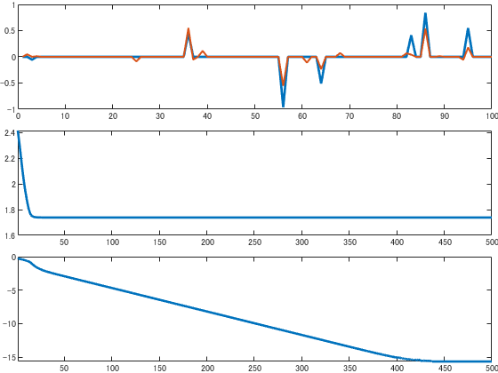

# Compressed sensing by ISTA

```matlab:Code
% Fix seed
rng(777);

% Set size of signal
L = 100;
K = 7;
N = 50;
```


```matlab:Code
% Generate sprase vector
ubar = zeros(L,1);
ind = randperm(L);
ubar(ind(1:K)) = 2*rand(K,1)-1;

% Generate obserbation matrix
phi = randn(N, L);

% Generate observation noise
n = randn(N,1);

% Calculate observed signal
vstar = phi*ubar;
v = vstar + n;
```


```matlab:Code
% Set soft-thresholding
proxl1 = @(u, gam) sign(u).*max(abs(u)-gam, 0);

% Calculate Lipschitz constant
lip = norm(phi'*phi);
```


```matlab:Code
% Initialize  variable
uinit = phi\v;
u = uinit;
lm = 12;
maxiter = 500;
costs = nan(maxiter,1);
diffs = nan(maxiter,1);

% Set cost function
cost = @(u) 1/2*norm(phi*u-v)^2+lm*sum(abs(u));

% Initialize visualization
figure;
tiledlayout(3, 1,'TileSpacing','compact','padding','none');
nexttile(1)
plot(ubar, 'LineWidth',2);
hold on,uplot = plot(u, 'LineWidth', 1.5);
ylim([-1., 1.]);

nexttile(2)
cplot = plot(costs, 'LineWidth',2);
xlim([1, maxiter])

nexttile(3)
dplot = plot(diffs, 'LineWidth',2);
xlim([1, maxiter])

% Main loop of ISTA
for m = 1:maxiter
    
    % Update u
    uold = u;
    u = proxl1(u-2/lip*(phi'*phi*u-phi'*v), lm*2/lip);
    
    % Visualization
    costs(m) = log10(cost(u));
    diffs(m) = log10(norm(u-uold)+eps);
    uplot.YData = u;
    cplot.YData = costs;
    dplot.YData = diffs;
    drawnow limitrate
    pause(0.1)
    
end
```





```matlab:Code
% Final visualization
fig = figure;
t = tiledlayout(3, 1,'TileSpacing','compact','padding','none');
nexttile(1)
plot(ubar, 'LineWidth',2);
hold on,uplot = plot(u, 'LineWidth', 1.5);
ylim([-1., 1.]);

nexttile(2)
cplot = plot(costs, 'LineWidth',2);
xlim([1, maxiter])

nexttile(3)
dplot = plot(diffs, 'LineWidth',2);
xlim([1, maxiter])

exportgraphics(t,'../data/ista.pdf')
```


