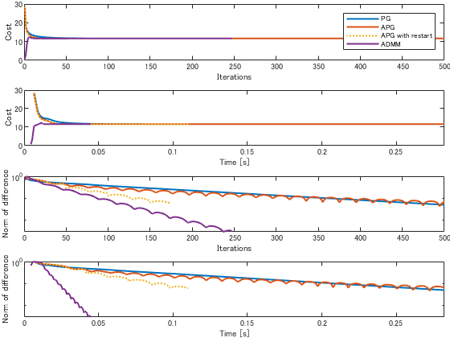

# LASSO example in Proximal algorithms


Code: \href{https://web.stanford.edu/~boyd/papers/prox_algs/lasso.html}{https://web.stanford.edu/\textasciitilde{}boyd/papers/prox_algs/lasso.html}


This unofficial reimprementation woks without CVX.


```matlab:Code
clear all;
rng(0);

% Data size
m = 200;  % number of examples
n = 1000;  % number of features

% Params
MAX_ITER = 500;
ABSTOL = 1e-14;
RELTOL = 1e-14;
SNR = 24;  % in dB
gamma_ratio = 0.1;
```


```matlab:Code
%  Data preparation
x0 = sprandn(n,1,0.05);
A = randn(m,n);
A = A*spdiags(1./sqrt(sum(A.^2))',0,n,n);
v = randn(m,1);
v = v/norm(v)*norm(A*x0)*10^(-24/20);
b = A*x0 + v;
```


```matlab:Code
% Set gamma
gamma_max = norm(A'*b,'inf');
gamma = gamma_ratio*gamma_max;

% cached computations for all methods
AtA = A'*A;
Atb = A'*b;
f = @(u) 0.5*norm(A*u-b)^2;
```


```matlab:Code
% Proximal gradient descent ()
lambda = 1;
beta = 0.5;

x = zeros(n,1);

tic;
for k = 1:2
    while 1 
        grad_x = AtA*x - Atb;
        z = prox_l1(x - lambda*grad_x, lambda*gamma);
        if f(z) <= f(x) + grad_x'*(z - x) + (1/(2*lambda))*norm(z - x)^2
            break;
        end
        lambda = beta*lambda;
    end
    x = z;
end
```


```matlab:Code
% Proximal gradient descent
lambda = 1;
beta = 0.5;

x = zeros(n,1);

tic;
for k = 1:MAX_ITER
    while 1 
        grad_x = AtA*x - Atb;
        z = prox_l1(x - lambda*grad_x, lambda*gamma);
        if f(z) <= f(x) + grad_x'*(z - x) + (1/(2*lambda))*norm(z - x)^2
            break;
        end
        lambda = beta*lambda;
    end
    h.prox_toc(k) = toc;
    h.prox_diff(k) = norm(x-z);
    h.prox_optval(k) = objective(A, b, gamma, x, x);
    
    x = z;

    if k > 1 && abs(h.prox_optval(k) - h.prox_optval(k-1)) < ABSTOL
        break;
    end
end

h.x_prox = x;
h.p_prox = h.prox_optval(end);
```


```matlab:Code
% Acceralated proximal gradient descent
lambda = 1;
x = zeros(n,1);
xprev = x;

tic;
for k = 1:MAX_ITER
    y = x + (k/(k+3))*(x - xprev);
    while 1
        grad_y = AtA*y - Atb;
        z = prox_l1(y - lambda*grad_y, lambda*gamma);
        if f(z) <= f(y) + grad_y'*(z - y) + (1/(2*lambda))*norm(z - y)^2
            break;
        end
        lambda = beta*lambda;
    end
    h.fast_toc(k) = toc;
    h.fast_diff(k) = norm(x-z);
    h.fast_optval(k) = objective(A, b, gamma, x, x);
    
    xprev = x;
    x = z;

    if k > 1 && abs(h.fast_optval(k) - h.fast_optval(k-1)) < ABSTOL
        break;
    end
end

h.x_fast = x;
h.p_fast = h.fast_optval(end);
```


```matlab:Code
% Acceralated proximal gradient descent with restart
lambda = 1;
x = zeros(n,1);
xprev = x;
kk = 1;

tic;
for k = 1:MAX_ITER
    if mod(k,50) ~= 0
        kk = kk+1;
        y = x + (kk/(kk+3))*(x - xprev);
    else
        kk = 0;
        y = x;
    end
    while 1
        grad_y = AtA*y - Atb;
        z = prox_l1(y - lambda*grad_y, lambda*gamma);
        if f(z) <= f(y) + grad_y'*(z - y) + (1/(2*lambda))*norm(z - y)^2
            break;
        end
        lambda = beta*lambda;
    end
    h.fastr_toc(k) = toc;
    h.fastr_diff(k) = norm(x-z);
    h.fastr_optval(k) = objective(A, b, gamma, x, x);
    
    xprev = x;
    x = z;

    if k > 1 && abs(h.fastr_optval(k) - h.fastr_optval(k-1)) < ABSTOL
        break;
    end
end

h.x_fastr = x;
h.p_fastr = h.fastr_optval(end);
```


```matlab:Code
% ADMM
lambda = 1;
rho = 1/lambda;
x = zeros(n,1);
z = zeros(n,1);
u = zeros(n,1);
[L U] = factor(A, rho);

tic;

for k = 1:MAX_ITER

    % x-update
    q = Atb + rho*(z - u);
    if m >= n
       x = U \ (L \ q);
    else
       x = lambda*(q - lambda*(A'*(U \ ( L \ (A*q) ))));
    end

    % z-update
    zold = z;
    z = prox_l1(x + u, lambda*gamma);

    % u-update
    u = u + x - z;

    % diagnostics, reporting, termination checks
    h.admm_optval(k) = objective(A, b, gamma, x, z);
    h.admm_diff(k) = norm(-rho*(z - zold));
    h.admm_rnorm(k) = norm(x - z);
    h.eps_pri(k) = sqrt(n)*ABSTOL + RELTOL*max(norm(x), norm(-z));
    h.eps_dual(k) = sqrt(n)*ABSTOL + RELTOL*norm(rho*u);
    h.admm_toc(k) = toc;

    if h.admm_rnorm(k) < h.eps_pri(k) && h.admm_diff(k) < h.eps_dual(k)
         break;
    end

end

h.x_admm = z;
h.p_admm = h.admm_optval(end);
```


```matlab:Code
% Visualization
fig = figure;
t = tiledlayout(4, 1,'TileSpacing','compact','padding','none');
nexttile(1);
plot(h.prox_optval, 'LineWidth', 1.5); hold on
plot(h.fast_optval, 'LineWidth', 1.5)
plot(h.fastr_optval, ':', 'LineWidth', 1.5)
plot(h.admm_optval, 'LineWidth', 1.5)
legend({'PG', 'APG', 'APG with restart', 'ADMM'})
xlabel('Iterations')
ylabel('Cost')

nexttile(2);
plot(h.prox_toc, h.prox_optval, 'LineWidth', 1.5); hold on
plot(h.fast_toc, h.fast_optval, 'LineWidth', 1.5)
plot(h.fastr_toc, h.fastr_optval, ':', 'LineWidth', 1.5)
plot(h.admm_toc, h.admm_optval, 'LineWidth', 1.5)
xlim([0, h.prox_toc(end)])
xlabel('Time [s]')
ylabel('Cost')

nexttile(3);
semilogy(h.prox_diff, 'LineWidth', 1.5);  hold on
semilogy(h.fast_diff, 'LineWidth', 1.5); 
semilogy(h.fastr_diff, ':', 'LineWidth', 1.5);
semilogy(h.admm_diff, 'LineWidth', 1.5);
xlabel('Iterations')
ylabel('Norm of difference')

nexttile(4);
semilogy(h.prox_toc, h.prox_diff, 'LineWidth', 1.5);  hold on
semilogy(h.fast_toc, h.fast_diff, 'LineWidth', 1.5); 
semilogy(h.fastr_toc, h.fastr_diff, ':', 'LineWidth', 1.5);
semilogy(h.admm_toc, h.admm_diff, 'LineWidth', 1.5);
xlim([0, h.prox_toc(end)])
xlabel('Time [s]')
ylabel('Norm of difference')
```





```matlab:Code
function p = objective(A, b, gamma, x, z)
    p = 0.5*norm(A*x - b)^2 + gamma*norm(z,1);
end

function [L U] = factor(A, rho)
    [m, n] = size(A);
    if m >= n
       L = chol(A'*A + rho*speye(n), 'lower');
    else
       L = chol(speye(m) + 1/rho*(A*A'), 'lower');
    end
    L = sparse(L);
    U = sparse(L');
end

function x = prox_l1(v, lambda)
    x = max(0, v - lambda) - max(0, -v - lambda);
end
```

