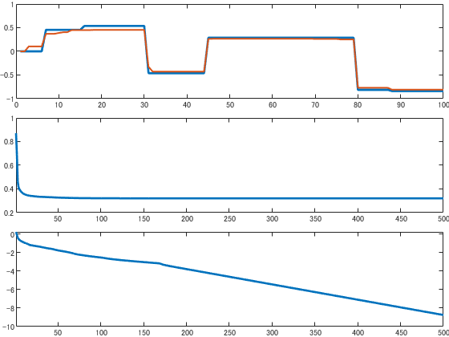

# 1D total variation by ADMM

```matlab:Code
% Fix seed
rng(777);

% Set size of signal
L = 100;
K = 7;
std_n = 0.1;
```


```matlab:Code
% Generate locally stationary signal
xbar = zeros(L,1);
ind = sort(randperm(L-2,K-1))+1;
ind = [ind,L];

for m = 1:K-1
    xbar(ind(m):ind(m+1)) = 2*rand(1)-1;
end

% Generate observation noise
n = std_n*randn(L,1);

% Calculate observed signal
v = xbar + n;
```


```matlab:Code
% Set soft-thresholding
proxl1 = @(z, gam) sign(z).*max(abs(z)-gam, 0);

% Differential operator
rowind = [(1:L)'; (2:L)'];
colind = [(1:L)'; (1:L-1)'];
vals = [ones(L,1); -1*ones(L-1,1)];
diffmat = sparse(rowind, colind, vals);
```


```matlab:Code
% Initialize  variable
zinit = diffmat*v;
yinit = zeros(size(zinit));
z = zinit;
y = yinit;

lm = 0.5;
gam = 1;
maxiter = 500;
costs = nan(maxiter,1);
diffs = nan(maxiter,1);

% Set cost function
cost = @(x) 1/2*norm(x-v)^2+lm*sum(abs(diffmat*x));

% Initialize visualization
figure;
tiledlayout(3, 1,'TileSpacing','compact','padding','none');
nexttile(1)
plot(xbar, 'LineWidth',2);
hold on,uplot = plot(v, 'LineWidth', 1.5);
ylim([-1., 1.]);

nexttile(2)
cplot = plot(costs, 'LineWidth',2);
xlim([1, maxiter])

nexttile(3)
dplot = plot(diffs, 'LineWidth',2);
xlim([1, maxiter])

% Main loop of ISTA
for m = 1:maxiter
    
    % Update x
    x = (gam*eye(L)+diffmat'*diffmat)\(gam*v+diffmat'*(z-y));
    
    % Update z
    z = proxl1(diffmat*x+y, lm*gam);
    
    % Update y
    y = y + diffmat*x -z;
    
    % Visualization
    costs(m) = log10(cost(x));
    diffs(m) = log10(norm(diffmat*x-z)+eps);
    uplot.YData = x;
    cplot.YData = costs;
    dplot.YData = diffs;
    drawnow limitrate
    pause(0.1)
    
end
```





```matlab:Code
% Final visualization
fig = figure;
t = tiledlayout(3, 1,'TileSpacing','compact','padding','none');
nexttile(1)
plot(xbar, 'LineWidth',2);
hold on,uplot = plot(x, 'LineWidth', 1.5);
ylim([-1., 1.]);

nexttile(2)
cplot = plot(costs, 'LineWidth',2);
xlim([1, maxiter])

nexttile(3)
dplot = plot(diffs, 'LineWidth',2);
xlim([1, maxiter])

exportgraphics(t,'../data/admm.pdf')
```


